# BESMANI Core V2 - Growth Engines ERD Impact Report v1.1

**Date:** 2026-08-16  
**Status:** Completed architecture impact assessment for an approved requirement; no Phase 2 implementation authorized  
**Inputs:** Master Database Architecture v1.0, Phase 1 Implementation Report (2026-08-13), and approved Growth Engines & Network Addendum v1.0 (2026-08-15)

## 1. Executive decision

The Phase 1 canonical foundation remains valid and must not be redesigned. The addendum introduces no conflict with canonical Users, Businesses, Locations, Memberships, Provider Profiles, ULIDs, legacy mappings, identity reconciliation, or the Medical trust boundary.

The existing Master Architecture already anticipated Services, Booking, Referral, Messaging, Media, Commerce, and Besmo. However, it does not define enough relational structure for the approved growth flywheel. Before Phase 2 begins, the ERD contract must be expanded to make network provenance, Campaign participation, structured service intent, scoped sharing, Appointment preparation, and result reuse first-class concepts.

This report is a design artifact only. No migration, model, controller, route, feature flag, database command, backfill, or runtime behavior is authorized or implemented by this update.

## 2. Phase 1 conflict assessment

| Phase 1 foundation | Decision | Impact |
|---|---|---|
| `canonical_users` and `CanonicalUser` compatibility naming | Retain | Provider and Customer remain one canonical identity. |
| `businesses_v2`, Locations, Memberships, and Roles | Retain | Network and content authority derive from canonical membership/location scope. |
| `provider_profiles` | Retain | Provider capability remains attached to a canonical User, not a second identity. |
| `user_profiles` | Retain with future media FK resolution | Do not place Style Profile, eligibility, social visibility, or preference payloads in this table. |
| `user_consents` | Retain | General legal consent is insufficient for media reuse; add resource-specific consent grants later. |
| `legacy_entity_maps` and reconciliation | Retain | Every migrated Referral, Recommendation, Booking, post, media item, and offer may use the same mapping infrastructure. |
| Medical boundary | Strengthen, do not merge | Generic Core stores only non-PHI content or controlled public copies. |

**Required Phase 1 migration change:** none. Any new structures must be additive migrations designed after this report and executed only on the approved server environment.

## 3. Required domain additions

### 3.1 Network and connections

Add these entities in the future Network domain:

- `connection_requests`: requester User, recipient User, optional initiating Business, context type/id, status, requested/responded timestamps.
- `connections`: two canonical Users in a normalized pair, connection type, origin/provenance, status, connected/ended timestamps.
- `follows`: follower User plus exactly one followed User, Provider Profile, or Business; status and notification preference.
- `blocks`: blocking User, blocked User/Business, scope, reason code, timestamps. Blocks must override follows, recommendations, messaging initiation, and personalization.

Connections and follows are distinct: a follow is directional discovery interest; a connection is an accepted relationship. Business membership must never be inferred from either.

### 3.2 Reference and recommendation

Referral and Recommendation are related but not interchangeable:

- Referral transfers or introduces a Customer/lead and has workflow, terms, booking, and reward consequences.
- Recommendation expresses trusted endorsement or response to a request and preserves provenance; it may later generate a Referral or Booking.

Add:

- `recommendation_requests`: requester, requested audience/scope, question, location/radius, Service Category/Service need, visibility, status, expiry.
- `recommendations`: recommender User, optional request, exactly one recommended Provider Profile/Business/Business Service, narrative, visibility, provenance source, status.
- `recommendation_evidence`: recommendation plus optional Appointment, Review, Referral, post, or media reference; verified relationship flags are derived, not user-entered.
- `recommendation_recipients`: direct recipients when a recommendation is shared privately.
- `recommendation_events`: viewed, saved, shared, converted to Referral, converted to Booking, withdrawn.

Add nullable `recommendation_id` and `campaign_offer_id` to future canonical `referrals`, with check/policy rules preventing cross-tenant or unauthorized provenance.

### 3.3 Messaging context

Retain `conversations`, `conversation_participants`, `messages`, and attachments, but replace an ever-growing set of nullable context columns with:

- `conversation_contexts`: conversation plus exactly one authorized context reference such as Referral, Recommendation Request, Recommendation, Appointment, Campaign Offer, post, or support case.
- `conversation_participant_scopes`: participant, acting Business/Location/Membership where relevant, role, access start/end, and removal reason.

A conversation can have one primary context and controlled secondary contexts. Context does not itself grant access; all participants require policy authorization. PHI-bearing content routes to protected Medical messaging.

### 3.4 Campaign and opportunity

Add a flexible Campaign domain rather than profession/day-specific tables:

- `campaigns`: owner type (`platform` or `business`), creator, type, title, description, visibility, geographic scope, start/end, status, referral/share flags, terms version.
- `recurring_schedules`: RFC 5545-compatible recurrence rule, timezone, effective dates, exception policy.
- `campaign_occurrences`: materialized occurrence window for discovery, booking, and capacity accounting.
- `campaign_audiences`: audience definition and human-readable label; no sensitive eligibility value is copied here.
- `campaign_eligibility_rules`: typed rule, operator, protected value/reference, verification requirement, policy version.
- `campaign_businesses`: Business opt-in, approval status, configured terms, timestamps.
- `campaign_locations`: participating Location.
- `campaign_services`: participating `business_service`, not only catalog Service.
- `campaign_offers`: Business-specific price/discount/reward/capacity terms with immutable terms version.
- `campaign_capacity_rules`: limit type, quantity, scope, period, and reservation behavior.
- `campaign_bookings`: Campaign Offer, occurrence, Appointment, Customer, terms snapshot, status.
- `opportunity_referrals`: Campaign Offer/occurrence to Referral/Recommendation/share provenance.
- `campaign_metrics`: aggregated reporting only; transactions remain the source of truth.

Commerce must snapshot applied Campaign Offer terms into Order/Appointment pricing. Eligibility evaluation must be auditable and must not expose sensitive attributes to participating Businesses beyond the minimum result required.

### 3.5 Happening on BESMANI

Happening is a read model, not a new source-of-truth Event table. Candidate sources include active Campaign Occurrences/Offers, public Recommendations, public posts, trending Looks/Services, nearby Businesses, and referral-enabled opportunities.

Future optional projections:

- `feed_candidates`: source type/id, audience/geographic keys, active window, ranking metadata, moderation state.
- `feed_impressions` and `feed_actions`: User/session, candidate, reason code, impression/action timestamps; exclude PHI and minimize sensitive personalization data.

Ranking must preserve an explanation reason and honor visibility, block, consent, campaign eligibility, and location policies.

### 3.6 Media foundation

Expand the future `media` contract before Social, AI Style, or Booking media is implemented:

- Add `media_kind`, `purpose`, `sensitivity_class`, `captured_at`, `metadata_json`, lifecycle/retention state, and optional source media lineage.
- Keep binaries in object storage; relational rows store metadata and immutable storage references.
- Add `media_variants` for thumbnails/transcodes/AI derivatives.
- Add `media_ownerships` when joint ownership/custody is required.
- Add `media_links` with typed, policy-controlled links to post, Appointment Brief item, AI generation, before/after set, Review, Provider portfolio, or Message.
- Add `media_consents`: subject User, media/resource scope, grantor, grantee User/Business, purposes, visibility, version, granted/revoked/expiry timestamps.
- Add `media_moderation`: scan/moderation state, decision, actor/model, timestamps.

Generic media IDs must never directly expose protected Medical storage objects. Public reuse of compliant medical-origin content requires a separate sanitized Core copy and explicit consent provenance.

### 3.7 My Page, Social, and UGC

Add:

- `posts`: author User, optional acting Business, post type, body, visibility, moderation/status, published timestamps.
- `post_media`: post, media, role, sort order.
- `comments`: post, author, optional parent comment, body, status.
- `reactions`: User, post/comment target, reaction type; unique per configured target/type rule.
- `saved_posts`: User and post.
- `shares`: sharer, source post/content, channel/audience, optional Referral/Recommendation/Campaign provenance.
- Explicit tag tables: `post_business_tags`, `post_provider_tags`, `post_service_tags`, and `post_appointment_tags`.
- `content_reports` and `content_moderation_actions`.

Appointment tags and before/after publication require authorization and consent; possession of an Appointment ID is not sufficient.

### 3.8 Customer Style Profile and preference schemas

Do not overload `user_profiles` or use a single unversioned JSON blob.

Add:

- `customer_style_profiles`: canonical User, status, default privacy, version timestamps.
- `style_profile_entries`: profile, preference key/type, structured value, optional Service Category/Service/Provider/Business scope, visibility.
- `style_profile_shares`: profile/entry scope, grantee User/Business, purpose, optional Appointment, granted/revoked/expiry timestamps.
- `saved_looks`: User, title, selected media/AI result, visibility, status.
- `service_preference_schemas`: owner scope (platform/vertical/Business), code, name, version, status/effective dates.
- `service_preference_fields`: schema, stable key, input/value type, label/help, validation constraints, sensitivity, sort order.
- `service_preference_options`: field, stable value, label, sort order/status.
- `service_preference_schema_assignments`: schema/version assigned to Service Catalog and optionally overridden for a Business Service.
- `service_preference_responses`: User, schema/version, optional Business Service/Appointment, status and submitted timestamp.
- `service_preference_response_values`: response, field/version, typed value or media reference.

Published schema versions become immutable. Appointment use stores or references an immutable response snapshot so later schema edits cannot alter historical intent.

### 3.9 AI Style / Look Builder

Add:

- `ai_style_sessions`: User, vertical/Service context, privacy, status, started/completed timestamps.
- `ai_style_inputs`: session, media, input role, user assertions, consent basis.
- `ai_style_generations`: session, parent generation, model/provider/config version, prompt/template reference, seed/provenance, status, safety decision.
- `ai_style_variants`: generation, output media, parameters/label, sort order.
- `ai_style_selected_results`: session, selected variant, approved_by_user_at, approval version, revoked_at.

AI output is intent/reference, not a guaranteed result. Appointment linking requires explicit Customer selection/approval. Model prompts, safety decisions, and actions must be auditable without exposing secrets.

### 3.10 Appointment Brief and scoped Provider Customer View

Extend future Booking with:

- `appointment_briefs`: Appointment, created by User, status/version, Customer submitted/Provider acknowledged timestamps.
- `appointment_brief_items`: typed item (`desired_outcome`, `question_answer`, `customer_note`, `provider_note`, `preparation_requirement`, `duration_implication`) with visibility and author context.
- `appointment_reference_media`: Brief, media, role (`current_condition`, `inspiration`, `desired_result`, `other`), consent reference.
- `appointment_ai_results`: Brief and approved AI selected result.
- `appointment_shared_preferences`: Brief and immutable preference response/profile-share snapshot.
- `appointment_access_grants`: Appointment, grantee User/Business Membership, resource scope, purpose, granted/revoked/expiry timestamps.

Provider Customer View must be a policy-filtered projection assembled from these grants and existing business membership. It must not be modeled as a copied Customer dossier and must not reveal the whole private My Page.

### 3.11 Provider preparation

Add:

- `appointment_preparations`: Appointment/Appointment Item, overall status, feasibility decision, duration adjustment, acknowledged timestamps.
- `provider_preparation_items`: typed task/requirement, status, due date, source (Customer/Provider/system/Besmo).
- `preparation_assignments`: preparation item and authorized Business Member.
- `preparation_notes`: preparation, author Membership/User, visibility, body, timestamps.
- `appointment_clarification_requests`: Appointment/Brief, requester, question, response, status/timestamps.

Staff assignment must reference `business_members`; rooms/equipment continue through `appointment_resources`.

### 3.12 Before/After and results

Add:

- `service_results`: completed Appointment Item, Customer, Provider Membership, Business/Location, outcome notes, status.
- `before_after_sets`: Service Result, before media, after media, capture timestamps, status.
- `result_publications`: result/set, destination (`customer_page`, `provider_portfolio`, `business_page`, `post`), consent, publisher, visibility, published/withdrawn timestamps.

The completed Appointment Item supplies provenance. Publication is separate from capture. Consent revocation disables future display without deleting the auditable service record.

### 3.13 Future inventory readiness

Retain Product, Variant, Inventory Location, and Inventory Level concepts, then add:

- `materials`: normalized consumable/product concept where not directly represented by a Product Variant.
- `business_service_materials`: Business Service and material/Product Variant applicability.
- `service_material_requirements`: requirement quantity/unit, option/preference conditions, substitution policy, effective dates.
- `appointment_material_requirements`: resolved immutable requirements for an Appointment Item.
- `inventory_reservations`: Inventory Level/Location, Appointment Item, quantity, status, expiry/release timestamps.
- `inventory_alerts`: Appointment/requirement, shortage type, severity, status.
- `material_substitutions`: requirement, proposed substitute, approval and reason.

Phase 2 must therefore keep `business_services` stable and location-aware. Booking must use `appointment_items` so materials and preparation attach to a specific Service occurrence, not only the Appointment header.

## 4. Changes required in existing planned entities

### `service_catalog`

- Preserve stable canonical identity, Category/Vertical, hierarchy, and default duration.
- Add an extensibility/capability relationship rather than profession-specific columns.
- Preference schema assignment must target catalog Service with version/effective dates.

### `business_services`

- Remain the Provider/Business offering and the central target for booking, Campaign participation, Referral settings, preference overrides, preparation rules, and material requirements.
- Preserve Business and optional Location scope.
- Do not embed Campaign discount, preference form, or material arrays as source-of-truth JSON.

### `appointments` and `appointment_items`

- Add optional `campaign_booking_id`/source provenance through a dedicated booking-source link or constrained FK design.
- Maintain Referral linkage and permit Recommendation provenance.
- Brief, preference, AI result, preparation, Service Result, and materials attach primarily to Appointment or Appointment Item through dedicated relations.

### `referrals`

- Make destination Provider possible through canonical Provider/Business Membership context when the receiving party is an independent Provider.
- Add optional Recommendation/Campaign provenance and Appointment association through controlled relations.
- Preserve immutable reward/discount terms and idempotent BC settlement.

### `conversations`

- Use context links and scoped participant authority; do not add one nullable FK for every future domain indefinitely.

### `media`

- Resolve Phase 1's forward `avatar_media_id`, `logo_media_id`, and later Service image references only after the central media lifecycle and consent rules are finalized.

### `orders` and `order_items`

- Snapshot Campaign discounts, eligibility decision reference, Service/Appointment title and price, and reward terms at purchase time.
- Inventory reservations and Service material reservations remain separate from commercial order lines.

## 5. ERD relationship impact

```mermaid
erDiagram
    CANONICAL_USER ||--o{ BUSINESS_MEMBER : holds
    BUSINESS ||--o{ BUSINESS_MEMBER : has
    BUSINESS ||--o{ BUSINESS_LOCATION : operates
    CANONICAL_USER ||--o| PROVIDER_PROFILE : may_have

    CANONICAL_USER ||--o{ CONNECTION : participates
    CANONICAL_USER ||--o{ FOLLOW : creates
    CANONICAL_USER ||--o{ RECOMMENDATION_REQUEST : asks
    CANONICAL_USER ||--o{ RECOMMENDATION : gives
    RECOMMENDATION_REQUEST ||--o{ RECOMMENDATION : receives
    RECOMMENDATION }o--o| PROVIDER_PROFILE : recommends
    RECOMMENDATION }o--o| BUSINESS : recommends
    RECOMMENDATION }o--o| BUSINESS_SERVICE : recommends
    RECOMMENDATION ||--o{ REFERRAL : may_generate

    SERVICE_CATALOG ||--o{ BUSINESS_SERVICE : offered_as
    SERVICE_CATALOG ||--o{ SERVICE_PREFERENCE_SCHEMA_ASSIGNMENT : configures
    BUSINESS_SERVICE ||--o{ SERVICE_PREFERENCE_SCHEMA_ASSIGNMENT : overrides
    SERVICE_PREFERENCE_SCHEMA ||--o{ SERVICE_PREFERENCE_FIELD : contains
    SERVICE_PREFERENCE_FIELD ||--o{ SERVICE_PREFERENCE_OPTION : offers
    CANONICAL_USER ||--o{ SERVICE_PREFERENCE_RESPONSE : submits

    CAMPAIGN ||--o{ CAMPAIGN_OCCURRENCE : occurs_as
    CAMPAIGN ||--o{ CAMPAIGN_BUSINESS : includes
    CAMPAIGN_BUSINESS ||--o{ CAMPAIGN_OFFER : configures
    BUSINESS_SERVICE ||--o{ CAMPAIGN_OFFER : participates
    BUSINESS_LOCATION ||--o{ CAMPAIGN_OFFER : hosts
    CAMPAIGN_OFFER ||--o{ CAMPAIGN_BOOKING : converts
    CAMPAIGN_OFFER ||--o{ REFERRAL : enables

    CANONICAL_USER ||--o{ AI_STYLE_SESSION : owns
    AI_STYLE_SESSION ||--o{ AI_STYLE_GENERATION : generates
    AI_STYLE_GENERATION ||--o{ AI_STYLE_VARIANT : produces
    AI_STYLE_SESSION ||--o| AI_STYLE_SELECTED_RESULT : selects

    CANONICAL_USER ||--o| CUSTOMER_STYLE_PROFILE : owns
    CUSTOMER_STYLE_PROFILE ||--o{ STYLE_PROFILE_ENTRY : contains
    CUSTOMER_STYLE_PROFILE ||--o{ STYLE_PROFILE_SHARE : grants

    APPOINTMENT ||--|{ APPOINTMENT_ITEM : contains
    APPOINTMENT ||--o| APPOINTMENT_BRIEF : has
    APPOINTMENT_BRIEF ||--o{ APPOINTMENT_REFERENCE_MEDIA : includes
    APPOINTMENT_BRIEF ||--o{ APPOINTMENT_AI_RESULT : includes
    APPOINTMENT_BRIEF ||--o{ APPOINTMENT_SHARED_PREFERENCE : snapshots
    APPOINTMENT_ITEM ||--o| APPOINTMENT_PREPARATION : prepares
    APPOINTMENT_ITEM ||--o| SERVICE_RESULT : produces
    SERVICE_RESULT ||--o{ BEFORE_AFTER_SET : documents

    MEDIA ||--o{ POST_MEDIA : appears_in
    MEDIA ||--o{ APPOINTMENT_REFERENCE_MEDIA : referenced_by
    MEDIA ||--o{ AI_STYLE_VARIANT : generated_as
    MEDIA ||--o{ MEDIA_CONSENT : governed_by
    POST ||--o{ POST_MEDIA : contains
    BEFORE_AFTER_SET ||--o{ RESULT_PUBLICATION : may_publish

    BUSINESS_SERVICE ||--o{ SERVICE_MATERIAL_REQUIREMENT : requires
    APPOINTMENT_ITEM ||--o{ APPOINTMENT_MATERIAL_REQUIREMENT : resolves
    APPOINTMENT_MATERIAL_REQUIREMENT ||--o{ INVENTORY_RESERVATION : reserves

    CONVERSATION ||--o{ CONVERSATION_PARTICIPANT : includes
    CONVERSATION ||--o{ CONVERSATION_CONTEXT : contextualized_by
```

The Mermaid diagram is intentionally logical. Final migration design must use explicit foreign keys and check constraints for one-of targets; generic polymorphic references are acceptable only in low-integrity projection/audit tables.

## 6. Cross-domain invariants

1. One human remains one canonical User; Provider is capability plus membership context.
2. All public-facing primary entities use non-sequential public IDs.
3. Business authority derives from active Membership and Location scope, never from a request parameter alone.
4. Referral, Recommendation, share, Campaign, Appointment, Review, and Result conversions preserve provenance.
5. Reward, discount, pricing, eligibility result, preference response, and Appointment Brief terms used in a transaction are versioned or snapshotted.
6. A Service definition is not a Business offering; Campaign, Booking, Referral settings, materials, and staff target `business_services` where provider-specific behavior matters.
7. Media capture, access, and publication are separate decisions. Consent is purpose-specific, revocable, and auditable.
8. Appointment access is least-privilege and time/purpose-bound; it never exposes the whole private My Page.
9. Generic Core contains no uncontrolled PHI. Medical content stays protected unless a compliant sanitized copy is explicitly released.
10. Besmo invokes authorized domain APIs, records decisions/actions, and cannot create bypass access through AI memory or prompts.
11. Blocks and revoked grants override discovery, messaging, sharing, and personalization.
12. Deletion/withdrawal preserves financial, safety, consent, and audit records while removing public visibility according to policy.

## 7. Decisions required before Phase 2 implementation

These are design approvals, not implementation tasks:

1. Approve the canonical names and ownership rules for Service Catalog, Business Service, and schema assignments.
2. Approve versioning rules for preference schemas/responses and immutable Appointment snapshots.
3. Approve explicit target columns plus check constraints for Recommendation targets and typed tags.
4. Approve Media sensitivity classes, consent purposes, retention, object-storage layout, and derivative lineage.
5. Approve visibility vocabulary shared by Style Profile, posts, saved Looks, Recommendations, and result publications.
6. Approve Campaign recurrence representation, timezone rules, capacity reservation, eligibility verification, and terms snapshots.
7. Approve Conversation context/participant authorization and non-PHI classification.
8. Approve Appointment Brief access grants and Provider Customer View projection policy.
9. Approve Inventory unit-of-measure, Product Variant/material mapping, reservation, and substitution contracts.
10. Approve provenance/event contracts for Happening ranking, Campaign conversion, Referral/Recommendation, and BC settlement.

## 8. Revised delivery sequence

- **Pre-Phase 2 architecture gate:** approve this impact report, domain vocabulary, privacy/consent model, media contract, and ERD cardinalities.
- **Phase 2 - Catalog foundation:** Categories, Service Catalog, Business Services, prices/options/staff/resources, preference schema definitions and assignments, material requirement hooks. Do not build Social, Campaigns, AI Style, or Booking UI in this phase.
- **Phase 3 - Booking and intent:** availability, Appointments/Items, Briefs, preference response snapshots, approved AI-result links, access grants, Provider preparation, and material requirement resolution.
- **Phase 4 - Network growth:** canonical Referral/BC evolution plus Connections and Recommendation provenance.
- **Phase 5 - Campaigns and Commerce:** Campaign/Opportunity, offers, eligibility, recurrence, conversion, pricing snapshots, and commerce linkage.
- **Phase 6 - Messaging, Media, Social, and AI:** contextual messaging, central Media/consent, My Page/UGC, result publication, AI Style Builder, and Happening projections. Portions may be split into independently approved releases.
- **Later inventory execution:** stock reservations, alerts, reorder/substitution workflows built on the Phase 2/3 hooks.

The order may be delivered incrementally, but schema contracts created earlier must preserve the approved downstream relationships.

## 9. Server-only execution rule

- Architecture and source changes are prepared locally only.
- No local database migration, seed, backfill, schema mutation, or Phase 2 runtime implementation is performed.
- When additive migrations are later approved, run `migrate:status` and `migrate --pretend` first against the confirmed server/staging database, review the SQL, verify backups, then run the approved migration on the server.
- All canonical feature flags remain disabled until an explicit cutover decision.

## 10. Outcome

The approved addendum is now represented as a mandatory architecture input. Phase 1 remains intact. Phase 2 may not begin until the decisions in Section 7 are resolved and its Service/Business Service design demonstrably supports preference schemas, Appointment intent, Campaign participation, Referral/Recommendation provenance, preparation, result media, and future material requirements.
